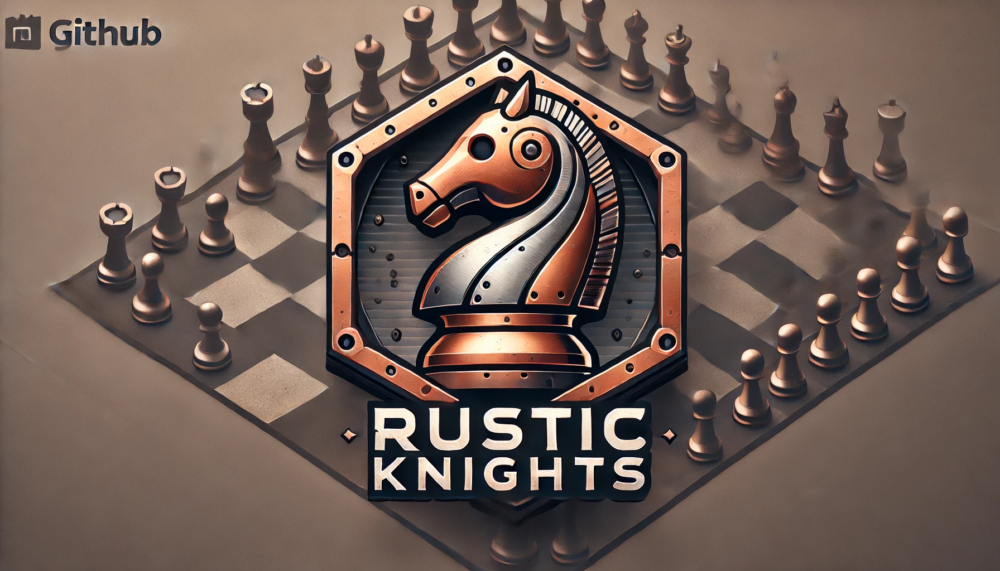

# Rustic-Knights

<div align="center">
  
  <h1>Rustic Knights</h1>
  <p>A modern, immersive 3D chess game powered by Rust and Babylon.js</p>
</div>

## 🎮 Overview

Rustic Knights combines the classic game of chess with modern 3D graphics and real-time multiplayer capabilities. Built with a robust Rust backend and an immersive Babylon.js frontend, it offers a unique chess-playing experience.

## ✨ Features

- 🎨 Immersive 3D graphics powered by Babylon.js
- ⚡ High-performance Rust backend
- 🔄 Real-time multiplayer gameplay
- 🎯 Intuitive controls and camera movement
- 🏰 Beautiful chess piece models and animations

## 🚀 Getting Started

### Prerequisites

- [Rust](https://rustup.rs/) (latest stable version)
- [Node.js](https://nodejs.org/) (v16 or higher)
- [Git](https://git-scm.com/)

### Installation

1. Clone the repository:
```bash
git clone https://github.com/heoj1N/rustic-knights.git
cd rustic-knights
```

2. Set up the backend:
```bash
cd backend
cargo build
```

3. Set up the frontend:
```bash
cd frontend
npm install
```

### Running the Application

1. Start the backend server:
```bash
cd backend
cargo run
```

2. Start the frontend server:
```bash
cd frontend
npx vite
```

3. Open your browser and navigate to `http://localhost:5173`

## 🛠️ Technology Stack

- **Backend**
  - Rust
  - Axum (Web Framework)
  - Tokio (Async Runtime)
  - Serde (Serialization)

- **Frontend**
  - Babylon.js
  - JavaScript
  - Vite (Build Tool)

## 🤝 Contributing

Contributions are welcome! Please feel free to submit a Pull Request.

1. Fork the repository
2. Create your feature branch (`git checkout -b feature/AmazingFeature`)
3. Commit your changes (`git commit -m 'Add some AmazingFeature'`)
4. Push to the branch (`git push origin feature/AmazingFeature`)
5. Open a Pull Request

## 📝 License

This project is licensed under the MIT License - see the [LICENSE](LICENSE) file for details.

## 🙏 Acknowledgments

- Chess piece models and textures
- Babylon.js community
- All contributors and supporters

---

<div align="center">
  Made with ❤️ by the Rustic Knights team
</div>
